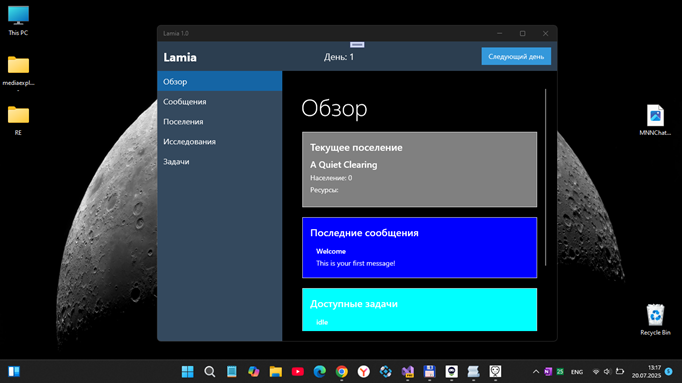

# LamiaUWP v1.0.0-pre-pre-pre-alpha (Draft)

Это UWP-порт случайно найденной "паузо-инкрементальной" игрульки Lamia. Так понял, автора вдохновила Kitten's Game. 

## Интро
Решил скормить "электронным мозгам" по имени Cloude AI исходники "интерфейсной" игрульки, используещие Godot, попросив адаптировать их на UWP. Вот делюсь его "результатами труда". Конеш, "товарищ" ленив, он лишь Godot-интерфейс проекта LamiaDesktop кое-как переплавил в C#-интерфейс проекта LamiaUWP. Но при этом проект LamiaSimulation как был типа .NET6, так и остался, эх...  Ну и подрубил ли он игровые ресурсы (картиночки) из папки _dev, сильно не уверен! Вообщем, сыро пока, очень сыро =) Пришлось засучить рукава, вручную создать LamiaSimulationUWP и покорпеть над своей задумкой, чтоб приложение хоть как-то запустилось!!! 

## От автора
" It has a front-end independent simulation layer that actually does the game logic written in plain-ass C# running on .Net 6.0.

The front end sends action requests and queries data. The current one is written with Godot. It has a paper-thin C# layer to communicate with the C# simulation, the rest of the front-end is GDScript.

(I initially started writing it with a C# front-end using ImGui, so this separation let me switch to Godot really quickly, it rules honestly. Can see myself doing a web-based front end one day.) " 

- [Fiona Summers](https://github.com/Fiona), game developer and pokemon obsessive

## Скриншот(ы)

## Обзор проекта Lamia (сгенерировано АИ)

В рамках проекта были созданы следующие компоненты для обеспечения взаимодействия между клиентской частью и симуляцией:

### Основные перечисления

### ClientQuery

Перечисление `ClientQuery` содержит типы запросов, которые клиент может отправлять симуляции:

- Запросы, связанные со страницами (доступные страницы, текущая страница)
- Запросы, связанные с сообщениями (все сообщения, новые сообщения)
- Запросы, связанные с исследованиями (доступные исследования, завершенные исследования)
- Запросы, связанные с ресурсами (доступные ресурсы, количество ресурсов)
- Запросы, связанные с поселениями (список поселений, информация о поселении)
- Запросы, связанные с населением (общее население, распределение по задачам)
- Запросы, связанные с задачами (доступные задачи, активные задачи)
- Запросы, связанные со зданиями (доступные здания, построенные здания)
- Запросы, связанные с улучшениями (доступные улучшения, приобретенные улучшения)
- Запросы, связанные с состоянием игры (текущее время, скорость симуляции)

### ClientAction

Перечисление `ClientAction` содержит типы действий, которые клиент может отправлять симуляции:

- Действия, связанные со страницами (переключение страницы)
- Действия, связанные с локациями (выбор локации)
- Действия, связанные с поселениями (создание поселения, переименование поселения)
- Действия, связанные с населением (распределение населения по задачам)
- Действия, связанные с сообщениями (пометка сообщения как прочитанного)
- Действия, связанные с задачами (активация задачи, деактивация задачи)
- Действия, связанные со зданиями (строительство здания, улучшение здания)
- Действия, связанные с ресурсами (сбор ресурсов, обмен ресурсов)
- Действия, связанные с исследованиями (начало исследования, отмена исследования)

### Структуры данных

### QueryResult

Класс `QueryResult` предназначен для хранения результатов запросов к симуляции. Он может содержать:

- Базовые типы данных (int, float, bool, string)
- Массивы (int[], float[], bool[], string[])
- Словари (Dictionary<string, int>, Dictionary<string, float>, Dictionary<string, bool>, Dictionary<string, string>)
- Сложные типы информации (SettlementInfo, BuildingInfo, ResearchInfo, UpgradeInfo, TaskInfo, Message)

### InfoStructures

Файл `InfoStructures.cs` содержит классы для хранения информации о различных игровых объектах:

- `Message` - класс для хранения сообщений (ID, заголовок, текст, время, прочитано)
- `SettlementInfo` - класс для хранения информации о поселении (ID, название, население, ресурсы)
- `BuildingInfo` - класс для хранения информации о здании (ID, тип, уровень, эффективность)
- `ResearchInfo` - класс для хранения информации об исследовании (ID, название, прогресс, требования)
- `UpgradeInfo` - класс для хранения информации об улучшении (ID, название, стоимость, эффект)
- `TaskInfo` - класс для хранения информации о задаче (ID, название, требуемые ресурсы, производимые ресурсы)

### Вспомогательные классы

### TaskType

Класс `TaskType` предназначен для работы с типами задач. Он содержит:

- Свойства: ID, название, описание, производимые ресурсы
- Статические методы: регистрация типа задачи, получение типа задачи по ID, получение всех типов задач

### T (Локализация)

Статический класс `T` предназначен для локализации текстов. Он содержит:

- Словарь для хранения переводов
- Текущий язык (по умолчанию "ru")
- Статический конструктор для инициализации базовых переводов
- Методы: установка языка, получение перевода по ключу, добавление новых переводов

### Events

Файл `Events.cs` содержит классы для работы с событиями симуляции:

- Базовый класс `SimulationEventArgs`
- Производные классы для различных событий:
  - Разблокировка страниц
  - Появление ресурсов/населения в поселении
  - Покупка зданий
  - Разблокировка исследований/улучшений/задач/зданий
  - Добавление сообщений

### Interfaces

Файл `Interfaces.cs` содержит интерфейсы для работы с симуляцией:

- `IActionReceiver` - интерфейс для объектов, принимающих действия клиента
- `IQueryable` - интерфейс для объектов, отвечающих на запросы клиента
- `ISimulated` - интерфейс для симулируемых объектов

### DispatcherTimer

Класс `DispatcherTimer` является оберткой для `Windows.UI.Xaml.DispatcherTimer` и предоставляет:

- Событие `Tick`
- Свойство `Interval`
- Методы `Start` и `Stop` для управления таймером

### Архитектура системы

Взаимодействие между клиентской частью и симуляцией происходит через следующие компоненты:

1. `GameController` - основной контроллер игры, который связывает клиентскую часть с симуляцией
2. `Query` - система запросов, позволяющая клиенту получать информацию о состоянии симуляции
3. `Action` - система действий, позволяющая клиенту влиять на состояние симуляции
4. `Simulation` - ядро симуляции, которое обрабатывает запросы и действия клиента
5. `GlobalState` - глобальное состояние игры, которое хранит информацию о текущем состоянии симуляции

Эта архитектура обеспечивает четкое разделение ответственности между компонентами и позволяет легко расширять функциональность игры.

## Аутро, или Чё не сделано
- LamiaSumulationUWP (я сляпал лишь каркас, без адаптации под все случаи запросов)
- Проверка (review) LamiaUWP, исправление хотя бы основных косяков (имею ввиду оставшиеся функции, генерирующие исключение not implemented)
- Ну хоть какие то иконочки-картиночи внести надА (не хочет Cloude, мож DeepSeek разрулит? Хехе)

### Личные выводы
Любой АИ может лишь как оч. слабый ассистент в "разрабской рутине" выступить, то есть наклепать всего быстро и много. На бою же, когда даже такой вот вроде бы несложный варик игрульки подготовить (аля "прототип"), он начинает дико тупить (двоит классы, сущности, часто путается в "электронных мыслях"). Видно, что у него задача не сделать хорошо, а отправить максимально много запросов к своей "базе", быстро истратить все токены разраба, а потом делать ему мозК фразами типа "А ты купи Про версию"! Вообщем, считаю, чтобы пользовать ИИ, надо быть сверхопытным программистом. Иначе энта аццкая штука новичка просто запутает этим "вроде бы правильным результатом, только который вообще не пашет". Такие вот мыслИ вслух :) 

## Ссыли
- https://github.com/VitaliiTsilnyk/NGettext Кросс-платформенная .NET-реализация библиотеки GNU/Gettext
- https://github.com/Fiona/lamia Оригинальная Gogot-версия игры Lamia
- https://4pda.to/forum/index.php?showtopic=1003896 4PDA -  Android - Игры > Стратегия Kittens Game (текстовая игра в деревенском симуляторе) 

## ..
Как есть. Без поддержки. Чисто исследовательская шарманка. "Сделай сам", что называется)

## .
_Исследователь Медиа_ 2025

